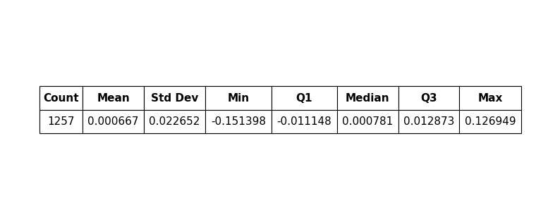
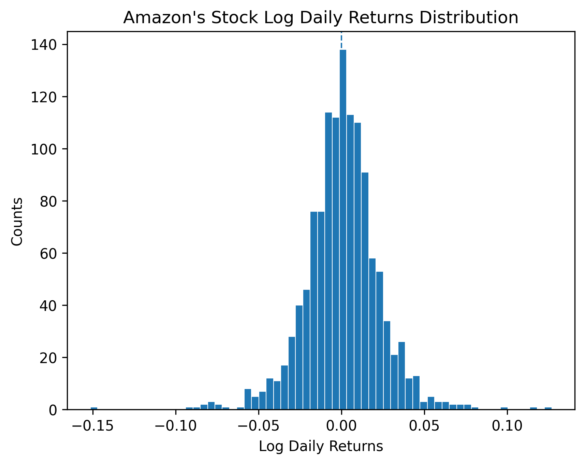
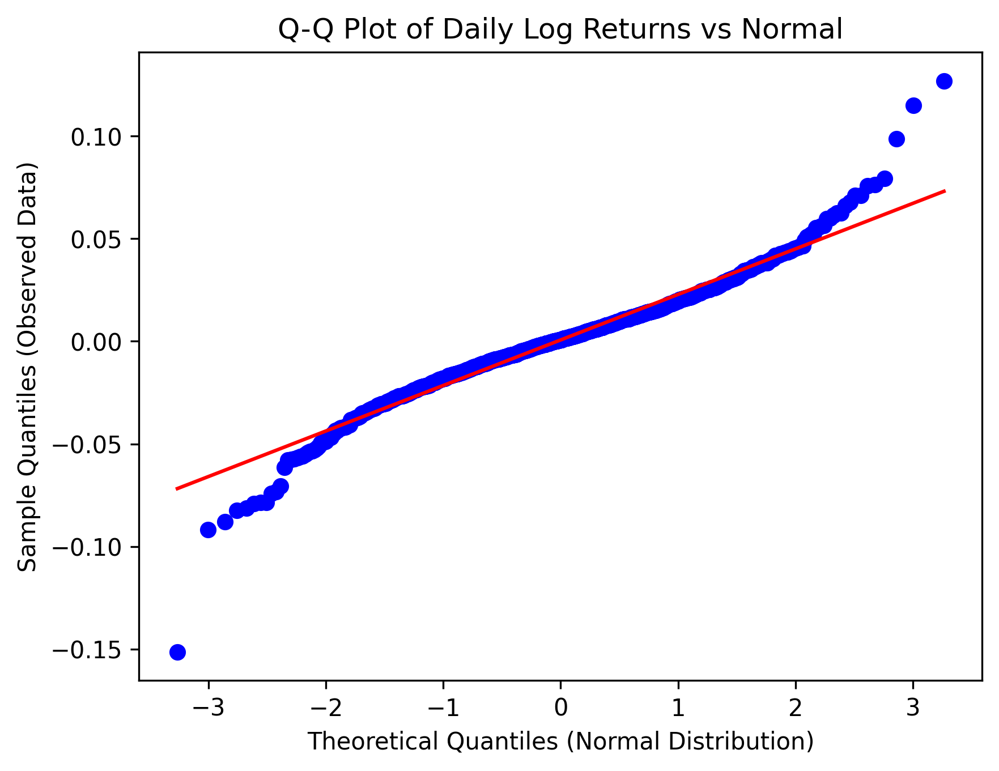
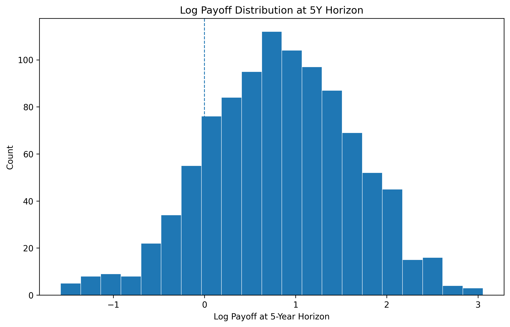
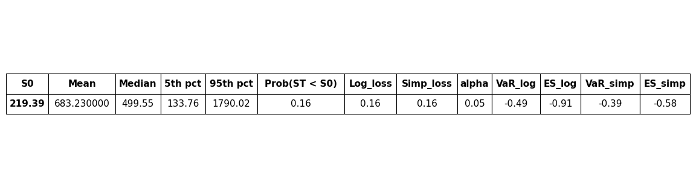

# Monte Carlo Stock Price Simulation with Rolling Backtest

## Project Summary

- **Model:** Geometric Brownian Motion (GBM), Monte Carlo Simulation, Maximum Likelihood Estimation
- **Forecast Horizon:** 5 years (1260 trading days)
- **Simulation Paths:** 1000
- **Backtest:** Rolling window (756-day training, 63-day testing, 21-day step)
- **Risk Metrics:** Value-at-Risk (VaR), Expected Shortfall (ES)

## 1. Introduction
In financial markets, stock prices are influenced by many factors, including macroeconomic policies, geopolitical events, and firm-level performance. Modeling the future behavior of stock prices is therefore challenging due to the complexity and uncertainty of these influences.

Traditional approaches, such as linear regression, can help analyze relationships between variables, but they may not fully capture the stochastic dynamics and inherent uncertainty of asset prices.

To address this, the Geometric Brownian Motion (GBM) framework provides a mathematically robust approach, assuming that asset prices follow a lognormal distribution. This preserves critical real-world properties such as non-negativity and multiplicative compounding. Under this framework, Monte Carlo simulation can be used to generate multiple possible future price paths and analyze the resulting distribution of returns.

In this project, we implement a Monte Carlo simulation to model the future price behavior of Amazon (AMZN) stock and evaluate its risk characteristics, including Value-at-Risk (VaR) and Expected Shortfall (ES). 

## 2. Data
Our target asset in this study is Amazon (AMZN). Historical stock price data are obtained using the `yfinance` API, covering the period from January 1, 2020 to January 1, 2025, with later data used for backtesting and comparison against realized outcomes. In this project, we use the adjusted closing price, which accounts for corporate actions such as dividends and stock splits and therefore better reflects the true return of the asset.

Based on the adjusted closing prices, we compute daily log returns, which are commonly used in financial modeling due to their desirable statistical properties, including time additivity.

Daily log returns are computed as:

$$r_t = \ln\left(\frac{S_t}{S_{t-1}}\right)$$

where $S_t$ and $S_{t-1}$ denote the adjusted closing prices at time $t$ and ${t-1}$.

  

*Table 1: Descriptive statistics of daily log returns.*

The mean daily log return is approximately 0.00067, while the standard deviation is about 0.02265, indicating that short-term price movements are primarily driven by volatility rather than average drift. These estimated parameters are later used in the Monte Carlo simulation. 

  

*Figure 1: Distribution of Amazon Daily Log Returns*

The histogram indicates that the distribution of daily log returns is approximately symmetric and centered around zero, which is broadly consistent with the normality assumption used in the Geometric Brownian Motion framework.

The distribution also exhibits several extreme observations in the tails, which reflect the presence of occasional large market movements.

  

*Figure 2: Q-Q plot of Amazon daily log returns compared with a normal distribution*

The Q-Q plot suggests that the distribution of daily log returns is approximately normal in the central region, as most observations lie close to the 45-degree reference line. However, noticeable deviations appear in the extreme quantiles, indicating the presence of fat tails and occasional extreme return events. Such behavior is commonly observed in financial return series.

Although financial returns often exhibit fat tails, the normality assumption provides a reasonable first-order approximation for modeling price dynamics under the Geometric Brownian Motion framework.

## 3. Methodology
In this project, the Geometric Brownian Motion (GBM) framework is used, and the stochastic continuous-time model is:

$$dS_t = \mu S_t \, dt + \sigma S_t \, dW_t$$

where $S_t$ denotes the asset price at time $t$, $\mu$ represents the drift (expected return), $\sigma$ denotes volatility, and $W_t$ is a standard Brownian motion.

The discrete solution of GBM is:

$$S_{t+\Delta t} = S_t \exp\left((\mu - \tfrac{1}{2}\sigma^2)\Delta t + \sigma \sqrt{\Delta t} Z_t\right)$$

where 

$$Z_t \sim N(0,1)$$

The discrete-time solution of the GBM process is used to simulate stock price paths. In this equation, $Z_t$ represents a standard normal random variable. At each time step, a random shock is drawn from the normal distribution and applied to the price dynamics. By repeatedly sampling these shocks, the Monte Carlo simulation generates multiple possible future price paths.

The parameters $\mu$ and $\sigma$ are estimated from historical daily log returns and are used as inputs in the Monte Carlo simulation. 

## 4. Monte Carlo Simulation

Using the estimated parameters from historical data, $\mu$ and $\sigma$, we generate possible future price paths for Amazon stock. In each simulation, random shocks are drawn from a standard normal distribution to represent unpredictable market movements.

For each simulation path, cumulative log returns are calculated by summing the simulated daily log returns over time. The cumulative returns are then converted into simulated future prices by applying the exponential transformation to the initial stock price.

By repeating this process for many independent simulation paths, the Monte Carlo approach produces a distribution of possible future stock prices. This distribution allows us to analyze potential future outcomes and evaluate risk metrics such as Value-at-Risk (VaR) and Expected Shortfall (ES).

A total of 1000 simulation paths are generated over a horizon of 1260 trading days, corresponding to approximately five years of future price evolution.

  

*Figure 3: Monte Carlo simulated future price distribution for Amazon stock under the GBM model. The blue and orange lines represent the mean and median simulated price paths. The shaded region represents the 5-95% prediction interval across simulation paths. The black line shows the observed stock price trajectory from 2025-2026.*

The observed price trajectory from 2025 to 2026 is overlaid on the simulated distribution for comparison. Although the realized path is only partially observed, it remains within the simulated 5-95% prediction interval. This suggests that the model captures a plausible range of potential future outcomes under the estimated parameters. However, the observed path fluctuates differently from the simulated central tendency, reflecting the unpredictable nature of real market dynamics.

## 5. Risk Distribution and Risk Metrics

At the end of the simulation horizon, each Monte Carlo path produces a possible terminal stock price and corresponding return. Taken together, these simulated outcomes form an empirical distribution of future prices and losses. This distribution provides a convenient basis for summarizing downside risk, including the probability of loss, Value-at-Risk (VaR), and Expected Shortfall (ES).
To evaluate downside risk, we compute both return-based and price-based summaries. In particular, we examine the probability that the ending price falls below the initial price, as well as tail-risk measures derived from the simulated return distribution.

  

*Figure 4: Distribution of simulated log payoffs at the five-year horizon. The dashed vertical line at zero separates positive and negative payoff outcomes.*

Figure 4 shows that most simulated log payoffs lie above zero, but the left tail remains visible, indicating that negative long-horizon outcomes are less likely than positive ones, yet still non-negligible.

  

*Figure 5: Distribution of simulated terminal prices at the five-year horizon. The red dashed line indicates the initial stock price, and the black dashed line marks the 5th percentile of simulated terminal prices.*

Figure 5 visually highlights the asymmetry of terminal prices: the distribution has a long right tail, while the left side is bounded by the fact that stock prices cannot fall below zero. This helps explain why the mean exceeds the median.

  

*Table 2: Summary of simulated terminal price distribution and downside risk metrics.*

The simulated terminal price distribution is strongly right-skewed. The mean terminal price is approximately 683.23, while the median terminal price is lower at about 499.55. This gap indicates that a relatively small number of high-price simulation paths pull the mean upward, a common feature of lognormal price distributions under the GBM framework.

The 5th percentile of terminal prices is about 133.76, while the 95th percentile is about 1790.02, suggesting a very wide range of possible long-run outcomes. This reflects the compounding effect of uncertainty over a five-year horizon. Even when the daily drift is positive, accumulated volatility creates substantial dispersion in simulated future prices.

The estimated probability that the terminal price falls below the initial price is approximately 15.6%. Equivalently, about 84.4% of simulated paths end above the starting price. Under the assumptions of the model, this suggests that long-run upside remains the more likely scenario, although downside outcomes are still economically meaningful.

To summarize tail risk more formally, we compute Value-at-Risk (VaR) and Expected Shortfall (ES) at the 5% level. For simple returns, the 5% VaR is approximately -39.0%, meaning that 5% of simulated outcomes produce a loss of at least 39.0% over the horizon. The corresponding Expected Shortfall is about -57.9%, indicating that among the worst 5% of outcomes, the average loss is even more severe. The same pattern appears in log-return space, where the 5% VaR is about -49.5% and the Expected Shortfall is about -90.5%.

These results show that although the simulated distribution has substantial upside potential, the left tail remains important. In other words, the model produces a favorable central tendency but also implies that extreme downside outcomes can be severe when they occur.

## 6. Rolling Backtest

Rolling backtesting is used to evaluate whether the simulation model produces reasonable forecast intervals when applied repeatedly over time, rather than only for a single estimation period. This helps assess whether the model has practical predictive value under changing market conditions.

In this project, a rolling-window procedure is implemented using a 756-trading-day training window, a 63-trading-day forecast horizon, and a 21-trading-day step size. For each rolling iteration, the model parameters are re-estimated from the training window, and a Monte Carlo simulation is used to generate a distribution of cumulative returns over the next 63 trading days. The 5th and 95th percentiles of the simulated return distribution are then compared with the realized cumulative return over the same future horizon.

  

*Figure 6: Rolling backtest comparing realized cumulative returns with the simulated 5-95% prediction interval over repeated forecast windows.*

Figure 6 shows that the realized cumulative returns often remain within the simulated 5-95% prediction interval, although some deviations occur during periods of heightened market volatility. This suggests that the model captures the broad range of likely short-term outcomes, even if it does not perfectly track the exact realized path.

The rolling backtest is useful because it evaluates the model in a more realistic forecasting setting. Rather than fitting the model once and judging it only from a single outcome, rolling evaluation repeatedly asks whether realized returns remain plausible under the simulated distribution. In that sense, the backtest provides evidence that the GBM-based Monte Carlo framework offers a reasonable first-order approximation for return uncertainty, while also revealing where the model may struggle during more turbulent periods.

## 7. Limitations

Although the GBM-based Monte Carlo framework is mathematically convenient and interpretable, it has several important limitations.

First, the model assumes that daily log returns are independently and identically distributed and approximately normal. As shown earlier in the histogram and Q-Q plot, Amazon's historical returns exhibit occasional extreme observations and fat tails, which are not fully captured by the normality assumption. As a result, the model may underestimate the likelihood of unusually large market moves.

Second, the model assumes constant drift and constant volatility over time. In reality, financial markets often experience changing regimes, where volatility rises during crises and falls during calmer periods. The rolling volatility plot below illustrates that Amazon's historical volatility is not stable over time.

  

*Figure 7: Rolling annualized volatility of Amazon daily log returns.*

Figure 7 shows a clear time variation in volatility, with periods of elevated uncertainty followed by more stable intervals. This pattern is inconsistent with the constant-volatility assumption embedded in standard GBM. Because volatility clustering is common in financial data, a constant-parameter model may fail to fully reflect changing market risk conditions.

Third, the model does not incorporate firm-specific news, macroeconomic shocks, interest rate changes, or structural breaks. All future uncertainty is represented through random shocks drawn from a fixed distribution estimated from historical data. This makes the model useful for illustrating probabilistic outcomes, but less suitable for capturing sudden changes in economic conditions.

Finally, the backtest only evaluates whether realized returns fall within the simulated range, rather than testing more advanced forecast calibration measures. A more comprehensive study could assess interval coverage rates more formally, compare multiple models, or use alternative stochastic processes such as jump-diffusion models, stochastic volatility models, or GARCH-type specifications.

Overall, these limitations suggest that the current model should be interpreted as a baseline probabilistic framework rather than a fully realistic representation of stock price dynamics.

## 8. Conclusion

This project developed a reproducible Monte Carlo simulation framework for modeling the future price behavior of Amazon stock under the Geometric Brownian Motion assumption. Using historical adjusted closing prices, daily log returns were calculated, model parameters were estimated, and 1000 future price paths were simulated over a five-year horizon.

The simulation results show that the terminal price distribution is highly dispersed and right-skewed, with substantial upside potential but also meaningful downside risk. The estimated probability of ending below the initial price is approximately 15.6%, while the 5% Value-at-Risk and Expected Shortfall indicate that extreme losses, although relatively unlikely, can still be severe.

The rolling backtest further shows that realized short-horizon returns generally fall within the model's simulated prediction interval, suggesting that the framework provides a reasonable first-order approximation of return uncertainty. At the same time, the analysis also highlights important limitations, especially the assumptions of normality, independence, and constant volatility. 

Overall, this project demonstrates how Monte Carlo simulation can be used to translate historical return estimates into a full distribution of future price outcomes, making it a useful tool for probabilistic forecasting and risk analysis. While the model is intentionally simplified, it provides a strong baseline that could be extended in future work through more realistic volatility dynamics, heavier-tailed return distributions, or alternative stochastic processes.

