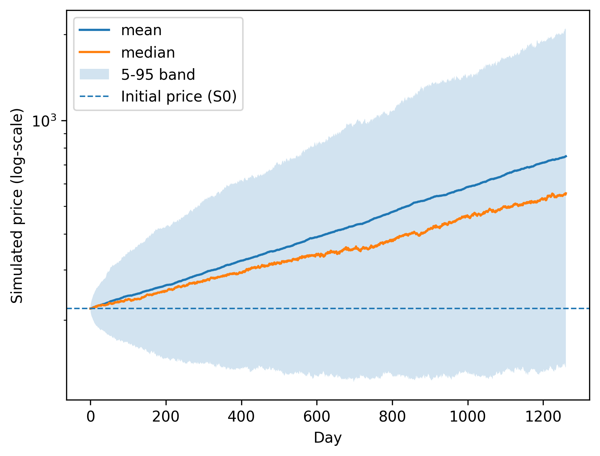
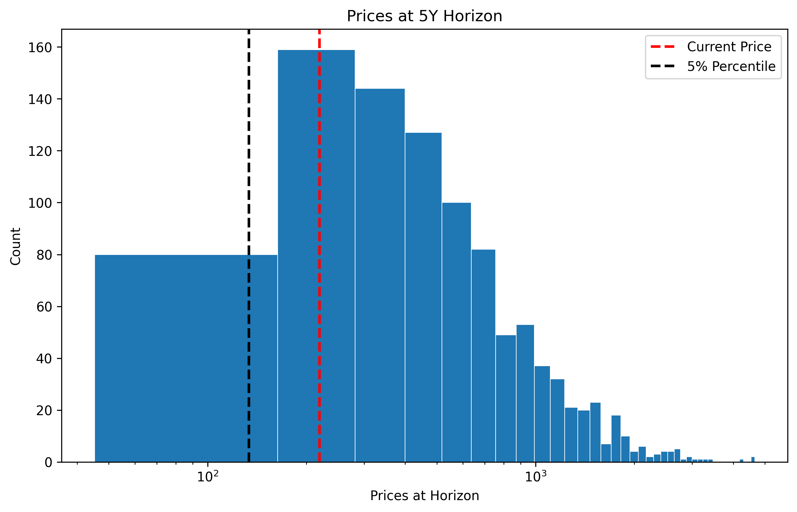
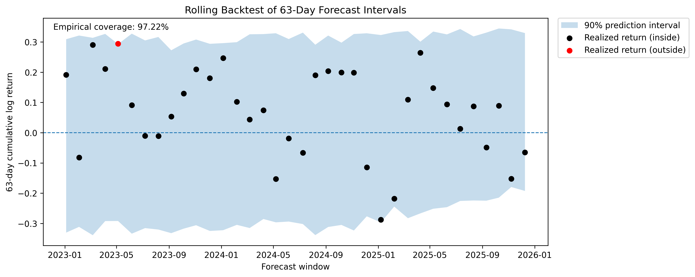
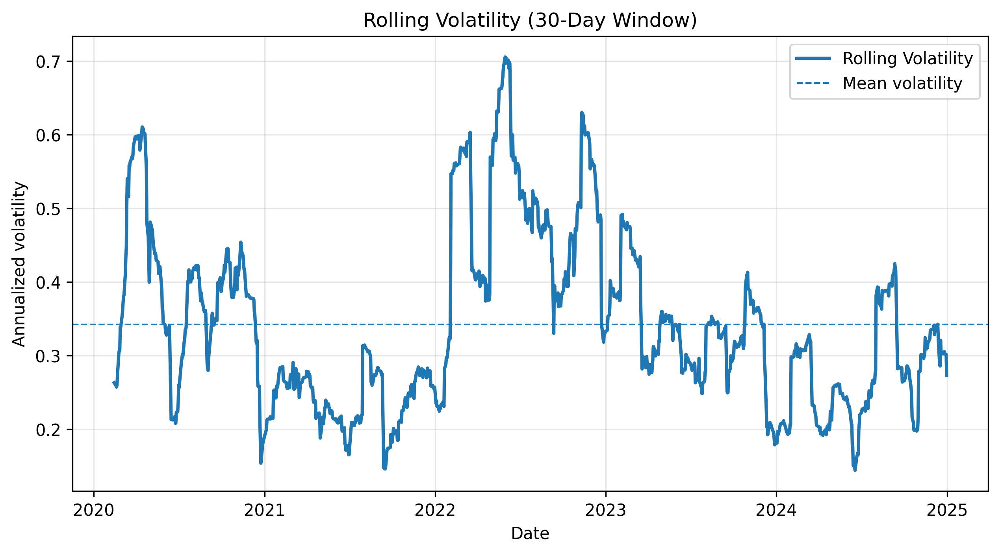

# Monte Carlo Stock Price Simulation with Rolling Backtest

## Project Summary

- **Model:** Geometric Brownian Motion (GBM)
- **Forecast Horizon:** 5 years (1260 trading days)
- **Simulation Paths:** 1000
- **Backtest:** Rolling window (756-day training, 63-day horizon)
- **Risk Metrics:** Value-at-Risk (VaR), Expected Shortfall (ES)

## 1. Introduction

## 2. Data

## 3. Model

## 4. Monte Carlo Simulation

  

*Figure 1: Monte Carlo simulated price paths for AMZN over a five-year horizon. The shaded region represents the 5–95% prediction interval.*

## 5. Risk Distribution

  

## 6. Rolling Backtest

  

## 7. Model Diagnostics

  

## 8. Risk Metrics

## 9. Limitations

## 10. Conclusion
